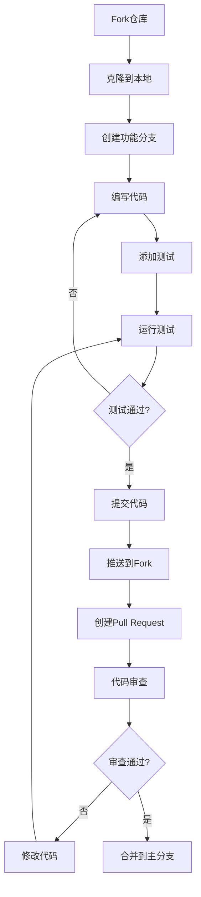

# CHTL项目贡献指南

## 欢迎贡献者

感谢您对CHTL项目的关注！CHTL是一个开源项目，我们欢迎所有形式的贡献，包括代码、文档、测试、Bug报告、功能建议等。本指南将帮助您了解如何参与CHTL项目的开发。

## 🤝 **如何贡献**

### 📝 **贡献类型**

我们欢迎以下类型的贡献：

| 贡献类型 | 说明 | 技能要求 |
|---------|------|----------|
| **🐛 Bug修复** | 修复已知问题和Bug | C++基础、问题分析 |
| **✨ 新功能** | 实现新的语言特性 | C++进阶、编译器原理 |
| **📚 文档改进** | 完善文档和教程 | 技术写作、CHTL使用经验 |
| **🧪 测试用例** | 添加单元测试和集成测试 | 测试框架、质量保证 |
| **🎨 示例代码** | 创建使用示例和教程 | CHTL语法、Web开发 |
| **🔌 CMOD/CJMOD** | 开发模块和扩展 | C++高级、模块开发 |
| **⚡ 性能优化** | 提升编译器性能 | 性能分析、算法优化 |
| **🌐 国际化** | 多语言支持 | 翻译、本地化 |

### 🚀 **快速开始**

1. **Fork项目**
   ```bash
   # 1. 在GitHub上Fork CHTL仓库
   # 2. 克隆您的Fork
   git clone https://github.com/YOUR_USERNAME/CHTL.git
   cd CHTL
   
   # 3. 添加上游仓库
   git remote add upstream https://github.com/CHTL-Team/CHTL.git
   ```

2. **设置开发环境**
   ```bash
   # 安装依赖
   ./scripts/install_dependencies.sh
   
   # 验证环境
   ./scripts/check_environment.sh
   
   # 构建项目
   ./scripts/build_debug.sh
   
   # 运行测试
   cd build_debug && make test
   ```

3. **创建功能分支**
   ```bash
   # 同步最新代码
   git fetch upstream
   git checkout main
   git merge upstream/main
   
   # 创建新分支
   git checkout -b feature/your-feature-name
   # 或者
   git checkout -b bugfix/issue-number
   ```

## 📋 **贡献流程**

### 🔄 **标准工作流程**



### ✅ **提交前检查清单**

在提交代码之前，请确保：

- [ ] 代码遵循项目编码规范
- [ ] 添加了适当的注释和文档
- [ ] 编写了相应的单元测试
- [ ] 所有现有测试仍然通过
- [ ] 更新了相关的文档
- [ ] 提交信息清晰、描述性强
- [ ] 没有引入新的编译警告或错误

### 📝 **提交信息规范**

我们使用[Conventional Commits](https://www.conventionalcommits.org/)规范：

```bash
<类型>[可选的作用域]: <描述>

[可选的正文]

[可选的脚注]
```

**提交类型：**
- `feat`: 新功能
- `fix`: Bug修复
- `docs`: 文档更改
- `style`: 代码格式（不影响代码含义）
- `refactor`: 重构（既不修复Bug也不添加功能）
- `perf`: 性能改进
- `test`: 添加缺失的测试或纠正现有测试
- `build`: 影响构建系统或外部依赖的更改
- `ci`: 对CI配置文件和脚本的更改
- `chore`: 其他不修改src或test文件的更改

**示例：**
```bash
feat(parser): 添加对CHTL JS新语法的支持

实现了await>>链式调用语法的解析和代码生成，
包括错误处理和性能优化。

Closes #123
```

## 🎯 **开发指南**

### 🏗️ **代码结构**

```
CHTL/
├── src/                    # 源代码
│   ├── CHTL/              # CHTL编译器核心
│   ├── CHTLJS/            # CHTL JS编译器
│   ├── Scanner/           # 统一扫描器
│   ├── CompilerDispatcher/# 编译器调度
│   ├── Util/              # 工具类
│   ├── Error/             # 错误处理
│   ├── Module/            # 模块管理
│   └── Test/              # 测试框架
├── tests/                 # 测试用例
├── docs/                  # 项目文档
├── scripts/               # 构建和打包脚本
├── examples/              # 示例代码
└── third-party/           # 第三方依赖
```

### 📏 **编码规范**

#### C++编码风格

```cpp
// 1. 类名：大驼峰命名
class CHTLParser {
public:
    // 2. 公有方法：小驼峰命名
    bool parseStatement();
    void generateCode();
    
    // 3. 常量：全大写+下划线
    static const int MAX_DEPTH = 100;
    
private:
    // 4. 私有成员：小驼峰+下划线后缀
    std::string current_token_;
    int line_number_;
    
    // 5. 私有方法：小驼峰命名
    void advanceToken();
    bool matchToken(TokenType type);
};

// 6. 命名空间：全小写
namespace chtl {
namespace parser {
    // 代码实现
}
}

// 7. 枚举：大驼峰+强类型
enum class TokenType {
    Identifier,
    Number,
    String
};
```

#### 代码格式

```cpp
// 8. 缩进：4个空格，不使用制表符
class ExampleClass {
public:
    // 9. 初始化列表格式
    ExampleClass(int value, const std::string& name)
        : value_(value)
        , name_(name)
        , initialized_(true) {
    }
    
    // 10. 条件语句格式
    if (condition) {
        doSomething();
    } else if (other_condition) {
        doSomethingElse();
    } else {
        doDefault();
    }
    
    // 11. 循环格式
    for (const auto& item : container) {
        processItem(item);
    }
    
    // 12. 长参数列表换行
    void longFunctionName(const std::string& first_parameter,
                         int second_parameter,
                         bool third_parameter,
                         const ComplexType& fourth_parameter);
};
```

#### 注释规范

```cpp
/**
 * @brief 简短描述类的功能
 * 
 * 详细描述类的用途、使用方法和注意事项。
 * 可以包含使用示例和相关链接。
 */
class DocumentedClass {
public:
    /**
     * @brief 解析CHTL源代码
     * 
     * @param source_code 要解析的CHTL源代码
     * @param options 解析选项，控制解析行为
     * @return 解析成功返回AST根节点，失败返回nullptr
     * 
     * @throws ParseException 当源代码包含语法错误时
     * 
     * @example
     * ```cpp
     * auto parser = std::make_unique<CHTLParser>();
     * auto ast = parser->parse("div { 'Hello World' }");
     * ```
     */
    std::unique_ptr<ASTNode> parse(const std::string& source_code,
                                   const ParseOptions& options = {});
    
private:
    // TODO: 实现缓存机制以提高性能
    // FIXME: 修复内存泄漏问题 (Issue #456)
    std::string current_token_;  ///< 当前正在处理的Token
};
```

### 🧪 **测试指南**

#### 单元测试

```cpp
// tests/CHTL/Parser/ParserTest.cpp
#include <gtest/gtest.h>
#include "CHTL/CHTLParser/Parser.h"

class CHTLParserTest : public ::testing::Test {
protected:
    void SetUp() override {
        parser_ = std::make_unique<CHTLParser>();
    }
    
    void TearDown() override {
        // 清理资源
    }
    
    std::unique_ptr<CHTLParser> parser_;
};

TEST_F(CHTLParserTest, ParseSimpleElement) {
    // Arrange
    std::string source = "div { 'Hello World' }";
    
    // Act
    auto ast = parser_->parse(source);
    
    // Assert
    ASSERT_NE(ast, nullptr);
    EXPECT_EQ(ast->getType(), NodeType::Element);
    
    auto element = static_cast<ElementNode*>(ast.get());
    EXPECT_EQ(element->getTagName(), "div");
    EXPECT_EQ(element->getChildren().size(), 1);
}

TEST_F(CHTLParserTest, HandleInvalidSyntax) {
    // 测试错误处理
    std::string invalid_source = "div { unclosed";
    
    EXPECT_THROW(parser_->parse(invalid_source), ParseException);
}

// 参数化测试
class ElementParsingTest : public ::testing::TestWithParam<std::pair<std::string, std::string>> {};

TEST_P(ElementParsingTest, ParseVariousElements) {
    auto [source, expected_tag] = GetParam();
    
    auto ast = parser_->parse(source);
    auto element = static_cast<ElementNode*>(ast.get());
    
    EXPECT_EQ(element->getTagName(), expected_tag);
}

INSTANTIATE_TEST_SUITE_P(
    BasicElements,
    ElementParsingTest,
    ::testing::Values(
        std::make_pair("div { }", "div"),
        std::make_pair("span { }", "span"),
        std::make_pair("p { }", "p")
    )
);
```

#### 集成测试

```cpp
// tests/Integration/CompilerTest.cpp
TEST(CompilerIntegration, FullCompilationPipeline) {
    std::string chtl_source = R"(
        div.container {
            h1 { "CHTL Integration Test" }
            
            script {
                listen buttonHandler = {
                    click: () => console.log('Clicked')
                };
            }
            
            style {
                .container { margin: 20px; }
            }
        }
    )";
    
    // 完整编译流程测试
    CHTLCompiler compiler;
    auto result = compiler.compile(chtl_source);
    
    ASSERT_TRUE(result.success);
    EXPECT_THAT(result.html, testing::HasSubstr("<div class=\"container\">"));
    EXPECT_THAT(result.html, testing::HasSubstr("<h1>CHTL Integration Test</h1>"));
    EXPECT_THAT(result.javascript, testing::HasSubstr("buttonHandler"));
    EXPECT_THAT(result.css, testing::HasSubstr(".container"));
}
```

#### 性能测试

```cpp
// tests/Performance/CompilerPerformanceTest.cpp
TEST(CompilerPerformance, LargeFileCompilation) {
    // 生成大型测试文件
    std::string large_source = generateLargeCHTLFile(10000);  // 10000行
    
    CHTLCompiler compiler;
    
    auto start = std::chrono::high_resolution_clock::now();
    auto result = compiler.compile(large_source);
    auto end = std::chrono::high_resolution_clock::now();
    
    auto duration = std::chrono::duration_cast<std::chrono::milliseconds>(end - start);
    
    ASSERT_TRUE(result.success);
    EXPECT_LT(duration.count(), 5000);  // 应在5秒内完成
    
    // 内存使用检查
    size_t memory_usage = getCurrentMemoryUsage();
    EXPECT_LT(memory_usage, 100 * 1024 * 1024);  // 应少于100MB
}
```

## 🐛 **Bug报告**

### 📋 **Bug报告模板**

使用以下模板报告Bug：

```markdown
## Bug描述
简洁清晰地描述Bug是什么。

## 重现步骤
1. 执行 '...'
2. 点击 '....'
3. 滚动到 '....'
4. 看到错误

## 期望行为
清晰简洁地描述您期望发生什么。

## 实际行为
清晰简洁地描述实际发生了什么。

## 截图或错误日志
如果适用，请添加截图或错误日志来帮助解释您的问题。

## 环境信息
- 操作系统: [例如 Ubuntu 20.04, Windows 10, macOS 12.0]
- 编译器: [例如 GCC 11.2, Clang 13.0, MSVC 2019]
- CHTL版本: [例如 1.0.0, commit hash]
- 其他相关信息

## 最小可重现示例
```chtl
// 请提供能重现问题的最小CHTL代码
div {
    // 问题代码
}
```

## 额外上下文
在此处添加有关问题的任何其他上下文。
```

### 🔍 **Bug修复流程**

1. **确认Bug**
   - 重现问题
   - 分析根本原因
   - 确定影响范围

2. **设计修复方案**
   - 评估不同解决方案
   - 考虑向后兼容性
   - 评估性能影响

3. **实现修复**
   - 编写修复代码
   - 添加回归测试
   - 更新相关文档

4. **验证修复**
   - 运行完整测试套件
   - 手动验证修复效果
   - 检查无副作用

## ✨ **功能请求**

### 📝 **功能请求模板**

```markdown
## 功能概述
简洁地描述您想要的功能。

## 问题描述
清晰地描述这个功能解决的问题。例如：我总是感到沫丧当[...]

## 解决方案描述
清晰简洁地描述您想要的解决方案。

## 替代方案
简洁地描述您考虑过的任何替代解决方案或功能。

## 使用场景
描述这个功能的典型使用场景。

## 示例代码
```chtl
// 展示新功能如何使用的示例代码
new_feature {
    property: value;
}
```

## 优先级
- [ ] 高 - 关键功能，阻碍项目使用
- [ ] 中 - 重要功能，提升用户体验
- [ ] 低 - 可选功能，有更好但非必需

## 额外信息
任何其他有用的信息、链接或参考资料。
```

### 🚀 **功能开发流程**

1. **需求分析**
   - 理解功能需求
   - 分析技术可行性
   - 评估开发工作量

2. **设计阶段**
   - 设计API接口
   - 规划实现方案
   - 考虑扩展性

3. **实现阶段**
   - 编写核心功能
   - 添加单元测试
   - 编写文档

4. **测试阶段**
   - 功能测试
   - 集成测试
   - 性能测试

5. **发布阶段**
   - 代码审查
   - 合并主分支
   - 更新版本说明

## 👥 **社区参与**

### 💬 **讨论和交流**

- **GitHub Discussions**: 技术讨论、功能请求、使用问题
- **GitHub Issues**: Bug报告、具体的技术问题
- **开发者邮件列表**: dev@chtl-lang.org
- **用户邮件列表**: users@chtl-lang.org

### 📅 **社区活动**

- **每月开发者会议**: 第一个周五晚上8点 (UTC+8)
- **季度版本规划**: 讨论下一版本的功能和优先级
- **年度CHTL大会**: 分享最佳实践和新功能
- **Hackathon**: 鼓励创新和实验性功能

### 🏆 **贡献者认可**

我们认可和感谢所有贡献者：

- **贡献者列表**: 在README中列出所有贡献者
- **年度奖项**: 最佳贡献者、最具创新性功能等
- **特殊徽章**: GitHub个人资料显示CHTL贡献者徽章
- **会议发言**: 邀请活跃贡献者在技术会议上发言

## 📚 **资源和学习**

### 🎓 **学习资源**

- **CHTL语法指南**: docs/core/CHTL语法文档.md
- **编译器开发指南**: docs/core/CHTL编译器开发指南.md
- **CJMOD开发教程**: docs/core/CJMOD开发指南.md
- **最佳实践**: docs/best-practices/
- **示例项目**: examples/

### 🛠️ **开发工具**

- **代码编辑器配置**: .vscode/, .idea/
- **调试工具**: docs/debugging.md
- **性能分析**: docs/profiling.md
- **CI/CD配置**: .github/workflows/

### 📖 **推荐阅读**

- 《编译原理》(龙书) - 编译器理论基础
- 《现代C++设计》 - C++高级编程技巧
- 《重构：改善既有代码的设计》 - 代码质量改进
- 《测试驱动开发》 - TDD实践指南

## 🔐 **安全政策**

### 🛡️ **安全问题报告**

如果您发现安全漏洞，请：

1. **不要公开报告** - 避免在公共Issue中讨论
2. **发送邮件** 到 security@chtl-lang.org
3. **提供详细信息** - 包括重现步骤和影响评估
4. **等待回应** - 我们将在24小时内回应

### 🔒 **安全最佳实践**

- 代码审查时特别关注安全问题
- 使用静态分析工具检测潜在漏洞
- 定期更新依赖项以修复安全问题
- 遵循安全编码标准

## 📄 **许可证和法律**

### ⚖️ **贡献者协议**

通过提交代码到CHTL项目，您同意：

1. **授权许可** - 您的贡献将在MIT许可证下发布
2. **原创性保证** - 您的代码是原创的或有权贡献
3. **无侵权保证** - 您的贡献不侵犯第三方权利

### 📋 **代码所有权**

- 您保留对原创代码的版权
- CHTL项目获得使用、修改和分发的权利
- 所有贡献者在项目中获得适当归属

---

感谢您考虑为CHTL项目做出贡献！每一个贡献，无论大小，都对项目的成功至关重要。如果您有任何问题，请随时通过GitHub Issues或邮件列表联系我们。

**让我们一起打造更好的CHTL！** 🚀